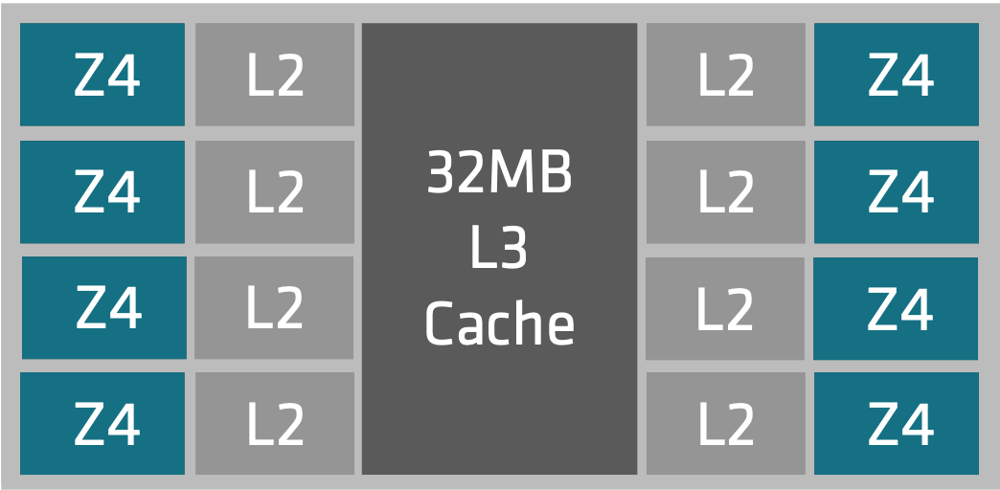

# Proxmox cpu affinity for VMs

## Introduction

It's not always clear why CPU affinity is important for virtual machines, especially since we usually skip this option in home labs. However, in production environments, using CPU affinity is crucial for improving VM performance.

In production, we usually deal with servers that have 32 or more cores.
These servers have complex CPU designs to handle many cores in one socket.
To manage large amounts of RAM, they use Non-Uniform Memory Access (NUMA).
NUMA improves memory access speed by splitting memory into different nodes, where each node has its own memory and CPU cores.

To make it easier to understand, let's use the AMD Zen 4 architecture (EPYC 9004) as an example
This architecture is designed with multiple cores and supports a large amount of memory.
In this setup, the NUMA architecture splits the system into different nodes, where each node has its own dedicated memory and CPU cores.


[Origin schema 4th generation architecture source](https://www.amd.com/en/products/processors/server/epyc/4th-generation-architecture.html)

In this example, we have 4 NUMA nodes.
Each node is directly connected to its own set of memory slots.
In the image, each node is connected to 6 memory slots, giving us a total of 24 slots (6 slots per node × 4 nodes)



The NUMA node includes 8 cores.
Each core has the L1d and L1i cache, L2 cache, and L3 shared cache between 8 cores.

AMD EPYC 9354 32-Core Processor, numa node and cache information:

```shell
# lscpu
Caches (sum of all):
  L1d:                   1 MiB (32 instances)
  L1i:                   1 MiB (32 instances)
  L2:                    32 MiB (32 instances)
  L3:                    256 MiB (8 instances)
NUMA:
  NUMA node(s):          4
  NUMA node0 CPU(s):     0-7,32-39
  NUMA node1 CPU(s):     8-15,40-47
  NUMA node2 CPU(s):     16-23,48-55
  NUMA node3 CPU(s):     24-31,56-63
```

So, we have one CPU socket with 32 cores and 64 threads.
* CPU chip has 4 NUMA nodes.
* each NUMA node has 8 cores.
* each core has 2 threads.
* each NUMA node has its own memory DDR5 slots and L3 cache.

Linux provides the `numactl` tool to show the NUMA node information:

```shell
# numactl -Hs
available: 4 nodes (0-3)
node 0 cpus: 0 1 2 3 4 5 6 7 32 33 34 35 36 37 38 39
node 0 size: 128654 MB
node 0 free: 12659 MB
node 1 cpus: 8 9 10 11 12 13 14 15 40 41 42 43 44 45 46 47
node 1 size: 129019 MB
node 1 free: 12883 MB
node 2 cpus: 16 17 18 19 20 21 22 23 48 49 50 51 52 53 54 55
node 2 size: 129019 MB
node 2 free: 12683 MB
node 3 cpus: 24 25 26 27 28 29 30 31 56 57 58 59 60 61 62 63
node 3 size: 128977 MB
node 3 free: 13114 MB
node distances:
node   0   1   2   3
  0:  10  12  12  12
  1:  12  10  12  12
  2:  12  12  10  12
  3:  12  12  12  10
```

If one node needs to access memory from another node, it takes longer than accessing memory from its own node.
The `node distances` show how long it takes to access memory between nodes: 10 for the same node and 12 for other nodes.

For the best performance, the application should run on the same NUMA node where its memory is allocated.
To utilize the most of the CPU cache, the app should use the same cores where the L1 and L2 cache are located.

By default, the Linux scheduler can move processes between cores and NUMA nodes.
When this happens, the process can lose its cache and memory speed.
The modern Linux scheduler is smart enough to move the process to the same NUMA node where the memory is allocated.
However, VMs don't have knowledge of the NUMA node and core layout, so the memory distance and cache info aren't available to the VM's scheduler.

To avoid NUMA migration and improve VM performance, CPU affinity can be used to bind the VM to specific cores and NUMA nodes.
Even if the Linux scheduler moves the process between cores, it will stay on the same NUMA node, keeping cache and memory access fast.

The well-known cloud providers based on the VM instance type provide the best placement on the physical server.
Similarly, Proxmox offers a CPU affinity feature for this purpose.

## Requirements

I assume you have a Proxmox server already installed and running.

## VM configuration

Create a VM with the desired configuration.
Check the CPU architecture and NUMA nodes.

```shell
lscpu | grep NUMA
```

Output should show the NUMA nodes and cores.

```shell
NUMA node(s):                       4
NUMA node0 CPU(s):                  0-7,32-39
NUMA node1 CPU(s):                  8-15,40-47
NUMA node2 CPU(s):                  16-23,48-55
NUMA node3 CPU(s):                  24-31,56-63
```

We have 4 numa nodes, each node has 8 cores and 8 threads.
If we want to bind VM to the specific NUMA node, we can use cpu affinity `0-7,32-39`.

The Proxmox VM configuration file should have the `numa`, `cpu` and `affinity` options.

```shell
cores: 16
cpu: cputype=host
affinity: 0-7,32-39
numa: 1
numa0: cpus=0-15,hostnodes=0,memory=114688,policy=bind
```

We create a VM with 16 cores and 112GB memory.
* `cpu` type is `host` for best performance.
* `affinity` is `0-7,32-39` to bind the VM to the NUMA node 0.
* `numa` is 1, to tell the VM that we have numa capabilities.
* `numa0` says that VM has numa node `0` with `16` cores, binded to host numa node `0`, memory `114688` MB allocated on the same NUMA node.

On the VM side we will have one NUMA node with 16 cores:

```shell
# lscpu | grep NUMA
NUMA node(s):                         1
NUMA node0 CPU(s):                    0-15
```

## Conclusion

Using CPU affinity for VMs is important in production.
It helps keep the application on the VM from moving between different NUMA nodes.
The app stays on the same NUMA node and uses the same L3 cache.
The Linux scheduler inside the VM also tries to keep the app running on the same CPU cores to use the L1 and L2 cache efficiently.

## References

* https://www.amd.com/en/products/processors/server/epyc/4th-generation-architecture.html
* https://pve.proxmox.com/wiki/Manual:_qm.conf
